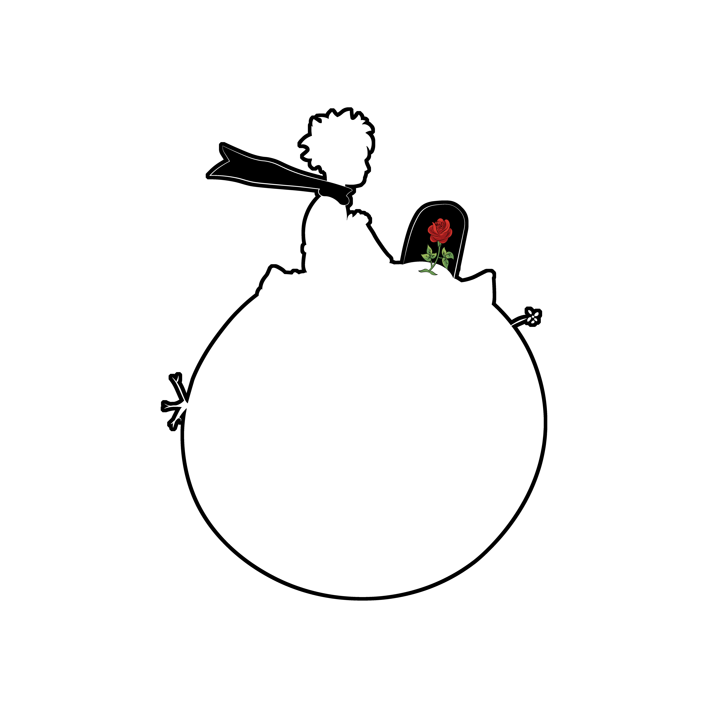

# CTF Solves collection

Here is my CTF solve collection, stored by CTFs in the order of my participations.
There will be no explanation on my source codes or whatsoever.

Feel free to use them as you wish !

> You will also find a few scripts that I use in the Scripts section.

## CTFs

| CTF | Year | Ranking | Username |
| :-: | :--: | :-----: | :------: |
| [FCSC](https://github.com/PetitPrinc3/CTFSolvesCollection/tree/main/1.%20FCSC) | 2022 | Top 200 | Gavroche |
| [404CTF](https://github.com/PetitPrinc3/CTFSolvesCollection/tree/main/2.%20404CTF) | 2022 | Top 100 | Gavroche |

## Scripts

- [+ FewScripts](https://github.com/PetitPrinc3/CTFSolvesCollection/tree/main/+%20FewScripts)
